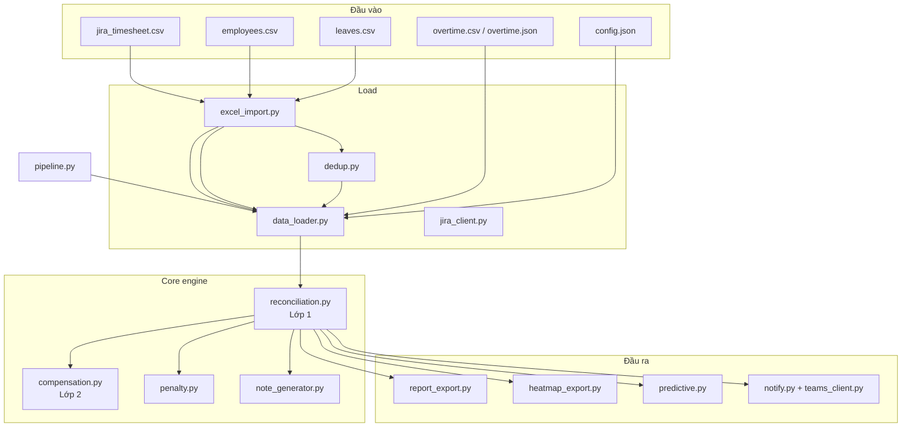

# Tài liệu source — Hệ thống Đối soát Logwork

> **Đề bài số 5** — Hackathon QA  
> **Tham chiếu SRS:** `SRS_LogWork_Audit_System_v4.docx`, `Tai_lieu_phoi_hop_nghiep_vu_Logwork.docx`  
> **Cập nhật:** 01/06/2026

Tài liệu này gom **giải thích toàn bộ source**, công thức nghiệp vụ, CLI và hướng dẫn mở rộng trong **một file duy nhất**.

---

## Mục lục

1. [Tổng quan](#1-tổng-quan)
2. [Kiến trúc & luồng dữ liệu](#2-kiến-trúc--luồng-dữ-liệu)
3. [Công thức nghiệp vụ](#3-công-thức-nghiệp-vụ)
4. [Cấu trúc thư mục (Clean Architecture)](#4-cấu-trúc-thư-mục-clean-architecture)
5. [Giải thích từng file Python](#5-giải-thích-từng-file-python)
6. [Fixtures & dữ liệu mock](#6-fixtures--dữ-liệu-mock)
7. [CLI & output](#7-cli--output)
8. [Golden file QA](#8-golden-file-qa)
9. [Mở rộng / thay dữ liệu thật](#9-mở-rộng--thay-dữ-liệu-thật)
10. [Trạng thái triển khai](#10-trạng-thái-triển-khai)

---

## 1. Tổng quan

Hệ thống **rule-based** (không ML) tự động hóa QA đối soát logwork Jira:

- Thu thập timesheet / leave / OT từ CSV hoặc mock JSON
- **Lớp 1:** kiểm tra từng ngày — thiếu giờ, không log, log thừa
- **Lớp 2:** phát hiện **bù trừ** (dồn giờ ngày này sang ngày khác)
- Tính phạt: **Missed MD × 20.000 VNĐ**
- Xuất báo cáo CSV (đơn vị **MD**), heatmap JSON, nhắc Teams

**Khóa chính đối soát:** `jira_account_id` (cột `Account`)

---

## 2. Kiến trúc & luồng dữ liệu



**Điểm vào vận hành:** `pipeline.run_week()` / `pipeline.run_month()` hoặc CLI `python -m logwork reconcile` (tuần) / `reconcile --month YYYY-MM` (tháng).

---

## 3. Công thức nghiệp vụ

### 3.1 Lớp 1 — Theo ngày

```
Required(day) = 8h − ngày lễ công ty − ngày phép cá nhân
ValidMax(day) = 8h + OT_approved (giờ)
Actual(day)   = SUM(worklog theo work_date, timezone VN)

Missed(day)   = Required − Actual   (nếu Actual < Required − 0.25h)
Missed (MD)   = Missed(h) / 8
Penalty       = Missed (MD) × 20.000 VNĐ
```

**Phân loại vi phạm (`DiscrepancyType`):**

| Type | Ý nghĩa |
|------|---------|
| `missing_day` | Không log cả ngày (Actual ≈ 0) |
| `under_hours` | Có log nhưng thiếu so với 8h |
| `over_hours` | Vượt ValidMax (chưa có OT) |
| `compensation` | Bù trừ Lớp 2 |
| `holiday_logged` | Log trên ngày lễ |
| `leave_violation` | Log trên ngày phép |

### 3.2 Lớp 2 — Bù trừ

Tuần **đủ tổng giờ** nhưng có ngày thiếu + ngày thừa tương ứng → flag cặp ngày (confidence: high/medium/low).

**Ví dụ SRS:** T2 = 16h, T6 = 0h → bù trừ cao.

### 3.3 Đối soát tháng (golden QA monthly)

Khi chạy `reconcile_month()` / `run_month()` / `--month YYYY-MM`:

```
Kỳ          = ngày 1 → cuối tháng (calendar)
Target (MD) = target_md_month từ employees.csv (vd. 21), hoặc số ngày làm việc − lễ
Lớp 2       = bù trừ theo từng tuần ISO trong tháng (split_by_week=True)
Export      = logwork_YYYY-MM_summary.csv
```

**Lưu ý so với golden QA:** Engine tính `Required (MD)` = tổng giờ bắt buộc theo ngày / 8. Một số sheet QA dùng `Required = Target − Holiday` — có thể lệch nhẹ; dùng `compare-golden` để đối chiếu từng Account.

### 3.4 Báo cáo QA (golden file)

Cột export khớp sheet QA:

| Cột | Nguồn |
|-----|-------|
| Account | `employee_id` |
| Full Name | `display_name` |
| Holiday | Số ngày lễ trong tuần |
| Actual (MD) | Tổng giờ log / 8 |
| Required (MD) | Tổng giờ bắt buộc / 8 |
| Missed (MD) | Tổng giờ thiếu / 8 |
| Penalty (VND) | `Missed MD × 20.000` |
| Target (MD) | Target tuần/tháng (config) |
| Note | Sinh tự động |

---

## 4. Cấu trúc thư mục (Clean Architecture)

```
logwork/
├── __init__.py          # Public API
├── __main__.py          # CLI entry point
├── paths.py             # Đường dẫn artifact (LOGWORK_DIR, FIXTURES_DIR, OUTPUT_DIR)
│
├── domain/              # Pure business logic (không phụ thuộc external)
│   ├── models.py        # Data classes + Enums
│   ├── reconciliation.py# Engine đối soát Lớp 1 + Lớp 2
│   ├── compensation.py  # Phát hiện bù trừ
│   ├── penalty.py       # Công thức phạt
│   ├── note_generator.py# Sinh cột Note tự động
│   └── period_utils.py  # Tiện ích ngày tháng
│
├── application/         # Use cases / orchestration
│   ├── pipeline.py      # run_week(), run_month()
│   ├── scheduler.py     # Job scheduler (predictive/reminder/close)
│   └── predictive.py    # Cảnh báo pace sớm trong tuần
│
├── infra/               # External adapters (IO, Jira, Teams)
│   ├── data_loader.py   # Load dữ liệu (CSV/JSON/Jira/Plugin)
│   ├── excel_import.py  # Parse CSV → domain objects
│   ├── dedup.py         # Loại trùng leave records
│   ├── jira_client.py   # Jira REST API client (Cloud/Server)
│   ├── timesheet_plugin_client.py  # Plugin ProjectTimesheet client
│   ├── holiday_plugin_client.py    # Plugin Effort/Holiday client
│   ├── notify.py        # Build + export notifications
│   ├── reminder_templates.py       # Template nội dung nhắc nhở
│   └── teams_client.py  # Gửi Teams Incoming Webhook
│
├── reporting/           # Output formatters
│   ├── report_export.py # Xuất CSV báo cáo
│   ├── heatmap_export.py# Xuất heatmap JSON
│   └── golden_validate.py  # Validate + compare golden file QA
│
├── tests/               # Unit tests
│   └── test_reconciliation.py
│
├── fixtures/            # Test data (không đổi)
│   ├── golden/          # Golden CSV
│   ├── golden_week.json
│   ├── jira.env.example
│   └── mock/            # Mock employees/timesheet/leaves/holidays
│
└── output/              # Generated files
    └── heatmap_viewer.html
```

**Quy tắc phụ thuộc:**
- `domain/` ← không import gì ngoài stdlib
- `application/` ← import `domain/`, `infra/`, `reporting/`
- `infra/` ← import `domain/`, `paths`
- `reporting/` ← import `domain/`
- `tests/` ← import tất cả layer khác

---

## 5. Giải thích từng file Python

### 5.1 domain/ — phép tính

#### `domain/models.py`

Định nghĩa **cấu trúc dữ liệu** toàn hệ thống:

| Class | Mục đích |
|-------|----------|
| `Employee` | NV: account, tên, email, team, center, target MD |
| `TimesheetEntry` | Một dòng logwork (account, ngày, giờ, issue, project) |
| `Holiday` / `EmployeeLeave` / `OvertimeRecord` | Nghỉ lễ, phép, OT |
| `Discrepancy` | Một vi phạm cụ thể (ngày, loại, giờ, phạt) |
| `DailyAudit` | Kết quả 1 ngày của 1 NV |
| `EmployeeWeeklySummary` | Tổng hợp tuần → 1 dòng báo cáo |
| `WeeklyReport` | Kết quả cả tuần |
| `AuditConfig` | min/max hours, phạt, ngưỡng bù trừ, predictive |

#### `reconciliation.py`

**Trái tim hệ thống.** Class `ReconciliationEngine`:

| Method | Việc làm |
|--------|----------|
| `working_days()` | Tính ngày làm việc (trừ T7/CN, trừ lễ) |
| `aggregate_hours()` | Gộp log theo `(account, ngày)` |
| `reconcile_week()` | Chạy Lớp 1 + Lớp 2 cho tuần ISO (T2→CN) |
| `reconcile_month()` | Cả tháng: `use_monthly_target=True`, bù trừ theo tuần |
| `reconcile_period()` | Core chung cho mọi khoảng ngày |

Luồng trong `reconcile_period()`:

1. Với mỗi NV × mỗi ngày làm việc → tính Required, Actual, Missed, Penalty
2. Gọi `detect_compensation()` (Lớp 2)
3. Kiểm tra log trên ngày lễ/phép/cuối tuần
4. Gọi `generate_employee_note()` → cột Note
5. Trả về `WeeklyReport`

#### `compensation.py`

| Symbol | Việc làm |
|--------|----------|
| `CompensationPair` | Cặp ngày thiếu ↔ ngày thừa |
| `detect_compensation()` | Pattern matching: tuần đủ tổng nhưng có ngày lệch |

Điều kiện: `|delta_thiếu − delta_thừa| ≤ compensation_threshold` (mặc định 2h).

#### `penalty.py`

| Function | Công thức |
|----------|-----------|
| `hours_to_md(h)` | `h / 8` |
| `calculate_penalty(missed_h)` | `round(h/8) × 20_000` |

#### `note_generator.py`

`generate_employee_note()` — gộp vi phạm thành chuỗi Note:

- `"Không log ngày 18/05, 20/05"`
- `"Log thiếu 4h ngày 20/05"`
- `"Bù trừ: 18/05 thiếu 8h ↔ 22/05 thừa 8h"`

---

### 5.2 Data — đọc đầu vào

#### `period_utils.py`

Tiện ích khoảng thời gian:

| Function | Việc làm |
|----------|----------|
| `week_range(anchor)` | Tuần ISO: Thứ 2 → Chủ nhật |
| `month_range(year, month)` | Ngày 1 → cuối tháng calendar |
| `parse_month("2026-05")` | Parse CLI `--month` → `(2026, 5)` |

#### `excel_import.py`

Parse CSV với **map cột linh hoạt** (Jira export thường dùng tên khác nhau):

| Loại file | Cột nhận diện |
|-----------|---------------|
| Timesheet | User/Author, Started/Work date, Time Spent/Hours |
| Employees | Account, Full Name, Email, Team, Center |
| Leaves | Account, Leave Date, Type |
| Overtime | Account, OT Date, OT Hours, Status |

Functions: `import_timesheet_csv()`, `import_employees_csv()`, `import_leaves_csv()`, `import_overtime_csv()`, `preview_csv()`.

#### `data_loader.py`

Orchestrate load → `WeekData` hoặc `PeriodData`:

| Class / Function | Nguồn |
|------------------|-------|
| `PeriodData` | Gom dữ liệu cho khoảng ngày bất kỳ (tháng, tuần) |
| `WeekData` | Tuần ISO + `anchor_date` |
| `load_config()` | `config.json` |
| `load_employees()` | `employees.csv` hoặc `.json` (cột `Target (MD)` → `target_md_month`) |
| `load_timesheet_for_period()` | CSV/JSON lọc theo `period_start`–`period_end` |
| `load_leaves()` | CSV + JSON, qua `dedup_leaves()` |
| `load_overtime()` | **`overtime.csv` ưu tiên**, sau đó `overtime.json` |
| `load_week()` | Gom tất cả cho 1 tuần (anchor date) |
| `load_month()` | Gom tất cả cho cả tháng calendar |

#### `timesheet_plugin_client.py` (**mới — Tinh Vân**)

Client cho plugin **ProjectTimesheet** (`vn.com.bng.ProjectTimesheet`) tại `jira.tinhvan.com`:

| REST Endpoint | Chức năng |
|---------------|-----------|
| `GET /rest/common-control/1.0/api/get-all-user` | Danh sách NV (id số + username) |
| `GET /rest/projectTimesheet/1.0/timesheet-log/count` | Tổng số bản ghi + tổng trang |
| `GET /rest/projectTimesheet/1.0/timesheet-log/search` | Worklog theo trang (20/page) |
| `GET /plugins/servlet/timesheetlogreport` | Download file export |

Đặc điểm:
- Date format: `1/May/26` (ngày/Tháng_abbr/năm_2số)
- `account` param = **numeric ID** (không phải username); tự lookup qua `get-all-user`
- Tự phân trang qua `count` → lấy `totalPages`
- Gọi song song từng NV (theo `employees.csv`) → nhanh

#### `jira_client.py`

| Class | Mô tả |
|-------|-------|
| `MockJiraClient` | Đọc CSV/JSON trong `fixtures/mock/` |
| `LiveJiraClient` | Jira REST API v2 (Server) / v3 (Cloud); env `JIRA_*`; thiếu credential → fallback CSV/mock |

| `create_jira_client(mock=...)` | `MockJiraClient` hoặc `LiveJiraClient` |

**Live Jira — biến môi trường:**

| Biến | Mục đích |
|------|----------|
| `JIRA_BASE_URL` | `https://jira.tinhvan.com` (Server 8.3.3) hoặc `https://*.atlassian.net` (Cloud) |
| `JIRA_USERNAME` | Username Jira Server (ưu tiên) |
| `JIRA_EMAIL` | Alias username (Server) hoặc email service account (Cloud) |
| `JIRA_API_TOKEN` | Password / PAT (Server) hoặc API token (Cloud) |
| `JIRA_API_VERSION` | `2` (Server, **tự động** với tinhvan.com) hoặc `3` (Cloud) |
| `JIRA_PROJECT_KEYS` | Lọc project, vd. `HVKHQS,INTERNAL` |
| `JIRA_ACCOUNT_FIELD` | Server: `name` (mặc định); Cloud: `email` |

Mẫu cấu hình Tinh Vân: `fixtures/jira.env.example`

Luồng API: JQL `worklogDate` → `/rest/api/2/search` → worklog từng issue → map `author.name` → `TimesheetEntry`.

#### `dedup.py`

`dedup_leaves()` — gộp trùng `(account, ngày)`, ưu tiên `source=jira` hơn `excel`.

#### `paths.py`

Hằng số đường dẫn: `LOGWORK_DIR`, `FIXTURES_DIR`, `MOCK_DIR`, `OUTPUT_DIR`.

---

### 5.3 Pipeline & CLI

#### `pipeline.py`

| Function | Việc làm |
|----------|----------|
| `run_reconciliation()` | Tạo engine; gọi `reconcile_week()` / `reconcile_month()` / `reconcile_period()` |
| `run_week()` | Full flow tuần: load → reconcile → export CSV/heatmap/predictive/reminders |
| `run_month()` | Full flow tháng: `load_month()` → `reconcile_month()` → export (label `YYYY-MM`) |
| `run_mock_week()` | Shortcut dùng `fixtures/mock/` |

#### `report_export.py`

`export_report_csv()` — 2 file:

1. `logwork_YYYY-MM-DD_summary.csv` hoặc `logwork_YYYY-MM_summary.csv` — báo cáo chính (**MD**)
2. `logwork_YYYY-MM-DD_compensation.csv` — bù trừ Lớp 2

#### `__main__.py`

Entry point CLI — xem [mục 6](#6-cli--output).

#### `__init__.py`

Export public API của package.

---

### 5.4 Cảnh báo & demo

#### `notify.py`

- `build_notifications()` — từ `Discrepancy` → list `Notification`
- `export_notifications()` — ghi `reminders_*.txt`

#### `reminder_templates.py`

`build_reminder(discrepancy, tên_NV)` — template rule-based cho Teams/email.

#### `teams_client.py`

- `get_webhook_url()` — đọc `TEAMS_WEBHOOK_URL`
- `send_teams_message()` — POST MessageCard
- `dispatch_notifications()` — gửi hoặc skip nếu không có webhook

#### `predictive.py`

Cảnh báo sớm (SRS FR-18, không ML):

| Loại | Logic |
|------|-------|
| `midweek_pace` | `logged/required < ngưỡng` T2 (20%) / T3 (40%) |
| `pattern` | Đọc `log_history.json` — hay quên cùng weekday |

#### `heatmap_export.py`

`export_heatmap_json()` — mỗi ô ngày: `actual`, `required`, `color`. File tháng: `heatmap_YYYY-MM.json`.

**Xem heatmap:** mở `logwork/output/heatmap_viewer.html` trong trình duyệt, chọn file JSON (hoặc đặt cùng thư mục với `heatmap_2026-05.json`).

#### `scheduler.py`

Dry-run job theo lịch QA:

| Job | Hành động |
|-----|-----------|
| `predictive` | Heatmap + predictive JSON |
| `reminder` | Nhắc NV |
| `weekly_close` | Chốt tuần + báo cáo + nhắc |
| `monthly_close` | `run_month()` — chốt tháng + heatmap + nhắc |

---

### 5.5 Golden file & test

#### `golden_validate.py`

| Function | Việc làm |
|----------|----------|
| `load_golden_csv()` | Đọc CSV golden QA |
| `validate_golden_rows()` | Kiểm tra `Penalty = Missed MD × 20k` |
| `compare_engine_to_golden()` | So từng Account: engine vs golden |

#### `test_reconciliation.py`

13 unit test — chạy: `python -m logwork test`

| Test | Kiểm tra |
|------|----------|
| `test_penalty_formula` | 4h → 10k, 8h → 20k |
| `test_golden_week_compensation` | Case SRS T2=16h/T6=0h |
| `test_mock_pipeline` | 6 NV mock |
| `test_csv_import` | Parse Jira CSV |
| `test_golden_validate_sample` | Golden mẫu QA |
| `test_month_reconcile` | Đối soát tháng 2026-05, 6 NV |

---

## 6. Fixtures — live vs mock

| Thư mục | Dùng cho | Nội dung |
|---------|----------|----------|
| `fixtures/live/` | **API + Web UI** | `config.json`, `holidays.json`, `employees.csv` (roster tùy chọn) |
| `fixtures/mock/` | CLI + `python -m logwork test` | NV/timesheet giả — **API không đọc** |

Override live: `LOGWORK_DATA_DIR=/path/to/live`

Worklog, nghỉ phép NV, tên hiển thị: **100% Jira** (ProjectTimesheet + Effort/Holiday + REST user).

```
fixtures/
├── mock/                          # Dữ liệu giả lập (thay khi có Jira/HR thật)
│   ├── config.json                # Chuẩn 8h, phạt 20k, project whitelist
│   ├── jira_timesheet.csv         # Format export Jira
│   ├── employees.csv
│   ├── leaves.csv
│   ├── holidays.json
│   ├── overtime.csv               # OT approved (ưu tiên hơn JSON)
│   ├── overtime.json
│   ├── log_history.json           # Lịch sử cho predictive pattern
│   └── timesheet.json             # Fallback nếu không có CSV
├── golden/
│   ├── report_sample.csv          # Mẫu golden từ ảnh QA
│   └── README.md
└── golden_week.json               # Unit test bù trừ SRS
```

**Kịch bản mock (tuần 18–22/05/2026):**

| Account | Kịch bản |
|---------|----------|
| `nguyenvana` | Log đủ — OK |
| `tranthib` | T2 không log, T4 thiếu 4h |
| `levanc` | Bù trừ T2=16h / T6=0h |
| `phamthid` | Nghỉ phép 21/05 |
| `hoangvane` | T3 log 10h không OT |
| `vuthif` | T4 log 10h + OT 2h approved |

---

## 7. CLI & output

### Lệnh thường dùng

```bash
# Test
python -m logwork test

# Đối soát tuần mock
python -m logwork reconcile
python -m logwork reconcile --remind --heatmap --predict

# Đối soát tháng (khớp golden QA monthly)
python -m logwork reconcile --month 2026-05
python -m logwork reconcile --month 2026-05 --plugin       # Plugin ProjectTimesheet (khuyen dung)
python -m logwork reconcile --month 2026-05 --live-jira    # Jira REST API (env JIRA_*)

# Vi du Tinh Van Jira Server
# set JIRA_BASE_URL=https://jira.tinhvan.com
# set JIRA_USERNAME=your_user
# set JIRA_API_TOKEN=your_password

# Scheduler
python -m logwork schedule --job monthly_close --month 2026-05

# Xem trước CSV
python -m logwork preview --file logwork/fixtures/mock/jira_timesheet.csv

# Scheduler dry-run
python -m logwork schedule --job weekly_close
python -m logwork schedule --job predictive

# Golden file
python -m logwork validate-golden --file logwork/fixtures/golden/report_sample.csv
python -m logwork compare-golden --engine logwork/output/logwork_2026-05-18_summary.csv --golden logwork/fixtures/golden/report_sample.csv
```

### Biến môi trường

| Biến | Mục đích |
|------|----------|
| `TEAMS_WEBHOOK_URL` | Gửi nhắc Teams thật |
| `JIRA_BASE_URL` | URL Jira (`https://jira.tinhvan.com`) |
| `JIRA_USERNAME` | Username (Server) |
| `JIRA_EMAIL` | Username hoặc email |
| `JIRA_API_TOKEN` | Password/PAT hoặc API token |
| `JIRA_API_VERSION` | `2` Server / `3` Cloud (tự động) |
| `JIRA_PROJECT_KEYS` | `PROJ1,PROJ2` |
| `JIRA_ACCOUNT_FIELD` | `name` / `email` / `accountId` |

### Output (`logwork/output/`)

| File | Nội dung |
|------|----------|
| `logwork_*_summary.csv` | Báo cáo chính (MD) |
| `logwork_*_compensation.csv` | Bù trừ |
| `heatmap_*.json` | Dữ liệu heatmap |
| `heatmap_viewer.html` | UI xem heatmap (mở local) |
| `predictive_*.json` | Cảnh báo sớm |
| `reminders_*.txt` | Nhắc NV |
| `scheduler_*.log` | Log job |

---

## 8. Golden file QA

### Loại golden file

| Loại | Mô tả | Dùng để |
|------|-------|---------|
| **Golden format** | Ảnh/CSV mẫu QA — cột, màu, quy tắc phạt | Thiết kế export |
| **Golden đầy đủ** | CSV + input Jira cùng kỳ | Auto-test 100% |

### Quy trình khi có file QA thật

1. Export sheet QA → `fixtures/golden/report_m2026_05.csv`
2. Export Jira cùng kỳ → `fixtures/golden/input/`
3. Chạy pipeline với input thật
4. `validate-golden` — kiểm tra quy tắc phạt trong file QA
5. `compare-golden` — so từng Account engine vs QA

---

## 8. Mở rộng / thay dữ liệu thật

| Muốn thay | Sửa file | Engine có đổi? |
|-----------|----------|----------------|
| Timesheet Jira | Cập nhật `employees.csv` account = username Jira, chạy `--plugin` | Không |
| Danh sách NV | `employees.csv` | Không |
| Ngày phép | `leaves.csv` | Không |
| OT | `overtime.csv` hoặc `overtime.json` | Không |
| Mức phạt / ngưỡng | `config.json` | Không |
| Công thức mới | `reconciliation.py`, `penalty.py` | Có |

**Nguyên tắc:** Chỉ sửa `data_loader` / import khi đổi nguồn dữ liệu; logic đối soát tách biệt.

---

## 10. Web UI + API (React + FastAPI)

### Cấu trúc

```
logwork/
├── api/                 # FastAPI REST
│   ├── main.py          # uvicorn entry, scheduler 17h T4
│   ├── auth_service.py  # Login Jira /myself + JWT
│   ├── user_pipeline.py # Plugin fetch theo creds user
│   └── routes/          # auth, dashboard, notifications
└── ui/                  # React + Vite (port 5173)
```

### Chạy dev

```powershell
# Cách nhanh (2 terminal tự mở):
.\logwork\scripts\run_dev.ps1

# Hoặc thủ công:
python -m uvicorn logwork.api.main:app --host 127.0.0.1 --port 8000 --reload
cd logwork/ui && npm run dev
```

### Phân quyền (JWT sau login Jira)

**Không** đọc vai trò Administrator / quản trị viên từ Jira. Mọi user Jira hợp lệ đều đăng nhập được; quyền app do env server quyết định:

| Role | Env | Quyền |
|------|-----|-------|
| `employee` | mặc định (env trống) | Chỉ dữ liệu cá nhân |
| `qa` | `LOGWORK_QA_USERS` | Đối soát team, heatmap team, golden, trigger job nhắc |
| `admin` | `LOGWORK_ADMIN_USERS` | QA + **Cấu hình** (`/admin/settings`) |

Trang **Cấu hình** yêu cầu account nằm trong `LOGWORK_ADMIN_USERS`. QA không chỉnh phạt/lễ/OT.

### API chính

| Endpoint | Mô tả |
|----------|-------|
| `POST /api/auth/login` | Username + password Jira → JWT |
| `GET /api/dashboard/summary` | Tổng hợp cá nhân (tuần/tháng, clip `as_of`) |
| `GET /api/dashboard/summaries` | QA: toàn team |
| `GET /api/dashboard/heatmap` | Heatmap JSON (QA = team, user = cá nhân) |
| `GET /api/dashboard/predictive` | Cảnh báo pace T2/T3 + pattern |
| `GET /api/dashboard/export/summary` | CSV summary (golden format, clip `as_of`) |
| `GET /api/dashboard/export/compensation` | CSV bù trừ Lớp 2 |
| `GET /api/dashboard/employees` | Admin cấu hình: tìm/chọn account Jira (+ roster) |
| `GET /api/notifications` | Thông báo vi phạm cá nhân |
| `POST /api/notifications/trigger` | QA: chạy job nhắc + email |
| `POST /api/notifications/purge` | QA: xóa cache thông báo cũ |
| `GET/PUT /api/admin/settings/*` | **Admin only** — phạt, OT rules, lễ, OT records |
| `POST /api/admin/golden/compare` | QA: upload CSV golden, so với engine |
| `POST /api/admin/golden/validate` | Kiểm tra cấu trúc CSV golden |
| `GET /api/schedule` | Lịch job nhắc 17h thứ Tư (+ last run) |

**Query kỳ** (dashboard + notifications + heatmap):

| Chế độ | Query |
|--------|-------|
| Tuần | `?start=YYYY-MM-DD&end=YYYY-MM-DD` |
| Tháng | `?month=YYYY-MM` |
| Legacy | `?week=YYYY-MM-DD` |

### Luồng dữ liệu UI

1. User login → xác thực Jira `/rest/api/2/myself`
2. Credentials lưu session (in-memory, TTL = JWT)
3. Dashboard / Heatmap gọi **ProjectTimesheet plugin** + **Effort/Holiday** với creds user
4. `as_of = min(hôm nay, cuối kỳ)` — không hiển thị ngày chưa tới
5. QA: `reconcile_for_team()` — fetch toàn worklog kỳ; lọc tùy chọn `LOGWORK_TEAM` / `LOGWORK_CENTER` / `LOGWORK_ROSTER_ONLY`
6. Golden compare + export dùng `clip_report(as_of)` — khớp số dashboard
7. Response gồm `compensation_pairs` (Lớp 2) và heatmap cells (màu theo trạng thái ngày)

### Trang UI

| Route | Mô tả |
|-------|-------|
| `/` | Tổng hợp tuần/tháng, bảng ngày, bù trừ, QA team |
| `/heatmap` | Lưới màu theo NV × ngày |
| `/notifications` | Nhắc vi phạm + job nhắc (QA) |
| `/admin/settings` | **Admin only** — cấu hình phạt, lễ, OT |
| `/admin/golden` | QA: upload CSV golden, so khớp engine |

---

## 11. Trạng thái triển khai

| Hạng mục | Trạng thái |
|----------|------------|
| Lớp 1 + Lớp 2 + phạt MD | ✅ |
| Import CSV + mock pipeline | ✅ |
| Export báo cáo MD | ✅ |
| Đối soát tháng (`--month`) | ✅ |
| Predictive + heatmap + scheduler | ✅ |
| Teams webhook (optional) | ✅ |
| Golden validate + compare | ✅ |
| `Jira REST API` thật | ✅ (cần env `JIRA_*`; thiếu env → fallback CSV) |
| Web UI + API login Jira | ✅ (chỉ Jira live, không mock auth) |
| API data dir `fixtures/live` | ✅ |
| Notification cache chỉ giữ batch Jira | ✅ |
| Heatmap + compensation trong UI | ✅ |
| Predictive + golden compare UI | ✅ |
| Export CSV + team stats QA dashboard | ✅ |
| Admin cấu hình phạt / lễ / OT + account search | ✅ |
| Job nhắc email + scheduler 17h T4 | ✅ |
| Lọc team/roster qua env | ✅ |
| Plugin `ProjectTimesheet` | ✅ (`--plugin`; nhanh hơn REST search) |
| So khớp 100% golden QA thật | ⏳ Chờ file CSV + input |

---

*Tài liệu duy nhất cho source logwork. Cập nhật file này khi thêm module mới.*
